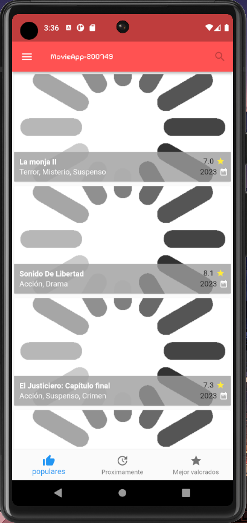
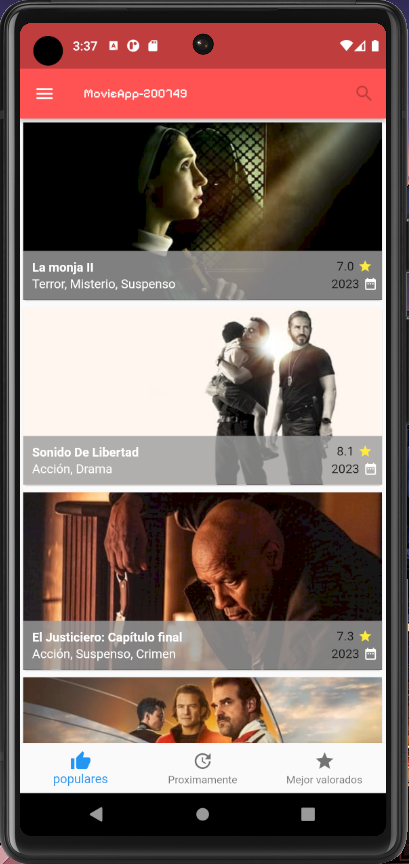
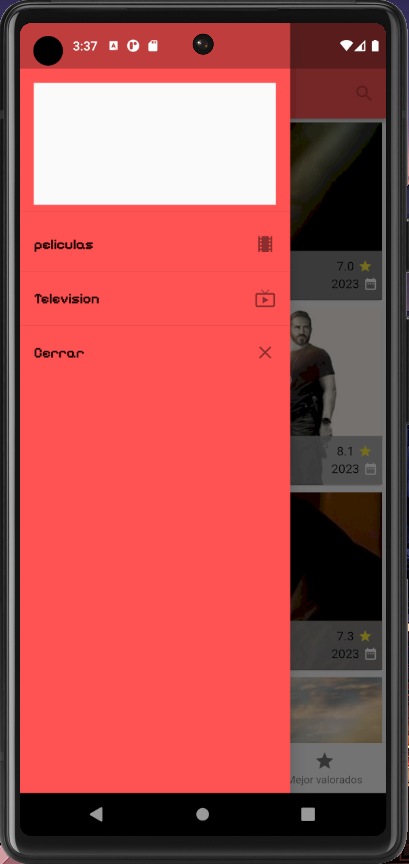

# DMI_PRACTICA10_200749

  
# Universidad Tecnológica de Xicotepec de Juárez

## Ingeniería en Desarrollo y Gestión de Software

## Desarrollo Movil Integral

## Marco Antonio Rosas Gonzalez
 
## 10° "A"

## Septiempre - Diciembre

## Descripción: Este proyecto consiste en una muestra de una aplicación desarrollada en Flutter que presenta la página de inicio de la aplicación "MovieApp-200749". En esta página de inicio, se encuentran los siguientes componentes clave:

**Home.dart**:
Dentro de este archivo, se encuentra la clase Home, que representa la página principal de la aplicación. En el método initState, se llama a la función _loadJson para cargar datos de películas utilizando HttpHandler. Además, se define un estilo de fuente personalizado y se crea la estructura principal de la aplicación, que incluye una AppBar (Barra de Navegación Superior), un Drawer (Menú Lateral) y un BottomNavigationBar (Barra de Navegación Inferior).

1. **AppBar (Barra de Navegación Superior)**:
   La AppBar muestra el título "MovieApp-200749" en el centro y un icono de búsqueda en la esquina derecha. Aquí es donde se puede realizar la navegación y las búsquedas.

2. **Menú Lateral (Drawer)**:
   El menú lateral se despliega deslizando desde el borde izquierdo de la pantalla o al tocar el icono de menú en la AppBar. Contiene las siguientes opciones:
   - "Peliculas": Esta opción muestra películas y utiliza un estilo de fuente personalizado para dar formato al texto.
   - "Television": Muestra programas de televisión y utiliza el mismo estilo de fuente personalizado.
   - "Cerrar": Permite cerrar el menú lateral y volver a la página de inicio.

3. **Barra de Navegación Inferior (BottomNavigationBar)**:
   La barra de navegación inferior contiene tres elementos:
   - "Populares": Muestra películas populares y presenta un ícono de pulgar hacia arriba.
   - "Proximamente": Muestra películas próximas a estrenarse y tiene un ícono de actualización.
   - "Mejor valorados": Muestra películas mejor valoradas y cuenta con un ícono de estrella.

**En resumen, este proyecto se enfoca en la creación de una interfaz de usuario para la aplicación "MovieApp-200749". La página de inicio incluye una AppBar, un menú lateral y una barra de navegación inferior, y se utiliza Flutter para mostrar información detallada sobre películas y programas de televisión.**

&nbsp;
&nbsp;

&nbsp;
&nbsp;

 
 
